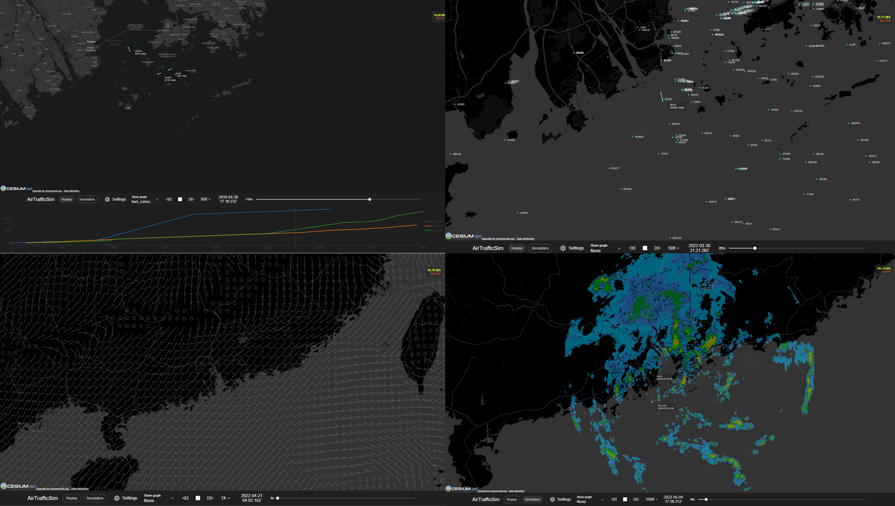

[](https://codecov.io/gh/HKUST-OCTAD-LAB/AirTrafficSim)
[](https://hkust-octad-lab.github.io/AirTrafficSim/)
[](https://anaconda.org/conda-forge/airtrafficsim)
[](https://joss.theoj.org/papers/7d4a9fdfae0c862863fa3645d3ae80b1)

AirTrafficSim is a web-based air traffic simulation software written in Python and javascript. It is designed to visualize historical and research data, perform microscopic studies of air traffic movement with the integration of a historical weather database, and evaluate the performance of ATM algorithms.

## Features

- Replay histortic flights given data (FlightRadar 24 and simulated flights)
- Air traffic simulation using [BADA 3.15 performance data](https://www.eurocontrol.int/model/bada)
- Navigation data simulation and visualization from [x-plane 11](https://developer.x-plane.com/docs/data-development-documentation/)
- Autopilot and Flight Management System simulation
- ATC traffic control methodology (Holding, vectoring, direct) simulation
- Weather data from [ECMWF ERA5](https://cds.climate.copernicus.eu/cdsapp#!/dataset/reanalysis-era5-pressure-levels?tab=overview) and custom radar image
- Air traffic is controlled with API interface to simulate ATC interaction




## Credits

If you find AirTrafficSim useful for your research, please cite the following until any relevant material is published:

```bibtex
@software{AirTrafficSim,
  author  = {Ka Yiu Hui, Chris HC. Nguyen, Go Nam Lui, Rhea P. Liem},
  title   = {AirTrafficSim},
  url     = {https://github.com/HKUST-OCTAD-LAB/AirTrafficSim},
  version = {0.0.1},
  date    = {2023-05-01},
}
```

## Installation

The latest stable release of AirTrafficSim can be installed from conda-forge. All dependencies will be installated automatically with the client pre-built and ready for use directly after installation.

It is recommended to install AirTrafficSim in a new conda environment:

```
conda create -n airtrafficsim -c conda-forge airtrafficsim 
```

Then, please initialise AirTrafficSim by specifing a folder path to create a symbolic link to the [airtrafficsim_data](data/) folder:

```
conda activate airtrafficsim
airtrafficsim -- init <path to a folder>
```
You may provide or retrieve any data of AirTrafficSim and create simulation environments in this folder. Please visit the [documentation](https://hkust-octad-lab.github.io/AirTrafficSim/index.html) for more information.

After installation, please also download, unzip, and store BADA 3.15 data files in [airtrafficsim_data/performance/BADA](data/performance/BADA/). In addition follow [this guide](https://cds.climate.copernicus.eu/api-how-to) to setup the API key for the weather database from ECMWF Climate Data Store.


## Running AirTrafficSim

You can run AirTrafficSim by executing the following commands. Please be reminded to activate the conda environment when you want to use AirTrafficSim. 

```
conda activate airtrafficsim
airtrafficsim
```

AirTrafficSim uses port 6111 for communicaiton. Please open or forward the port accordingly if needed. You should be able to open the UI using any modern browser at http://localhost:6111. You may also check the console for any messages when using AirTrafficSim.


You can also run AirTrafficSim without the UI by providing the name of the simulation environment which is listed in [environment](data/environment/). The environment name should be identical to the file name.

```
conda activate airtrafficsim
airtrafficsim --headless <environment name>
```

## Documentation

The detailed documentation for AirTrafficSim is available at [https://hkust-octad-lab.github.io/AirTrafficSim/](https://hkust-octad-lab.github.io/AirTrafficSim/), which include tutorials on navigations the UI and project structure as well as running different simulation environment.

## Contribution

AirTrafficSim is under active development. We welcome everyone intersted to contribute to the project and make AirTrafficSim more feature-rich. Please feel free to visit the detailed [contribution guide](./CONTRIBUTING.md) in this repository or in the [documentation](https://hkust-octad-lab.github.io/AirTrafficSim/development/guide.html).
